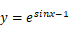
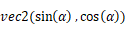
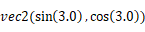
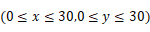

# Web3D工作室-立方教育(BabylonJS)
本项目致力于打破传统的MOOC平面式教育，让使用者能够沉浸于真实的学习、工作环境当中。能向虚拟人员接受学习任务，从书架上观看视频电子书籍，在工作台上观看电子书、完成练习任务。

## 项目概述
**使用的技术框架/库**
- BabylonJS （WebGL框架）
- React （前端框架）
- MobX （保存数据，驱动BabylonJS与React）
- Axios （网络请求）
- Ant Design （部分的GUI）
- Markdown-it （支持Markdown的React组件）
- pdfjs （支持PDF的React组件）
- use-local-storage-state （local storage Hook）
- recast-detour （A*自动寻路）

**文件夹结构**
- /blender （主要的建模Blender源文件）
- /public （贴图文件，图片文件，模型文件，NodeMaterial JSON文件，PDF文件，视频文件）
- /src/components （React GUI组件）
- /src/core **（主要的BabylonJS部分）**
- /src/network （网络请求部分）
- /src/typings （没用）
- /src/utils （辅助工具）

## 详细技术方案
### web3D场景组成结构
本系统由许多的场景组成，分层、有机地结合在一起，最顶层为整个web3D短视频学习教育平台场景，第二层根据不同的场景对象，被划分为了学院选择场景，学院内部楼层工作室选择场景，以及工作室内部场景。在工作室的内部场景中又有图书架，以及练习台场景。

### 数据流向图
MobX作为集中的数据管理，保存了从Axios网络请求库中返回的JSON数据，并将其转化成类，以供Typescript使用。BabylonJS与React的相互调用需要使用MobX作为中间桥梁。每当网络请求中有新的数据返回，MobX 提供了优化应用状态与 React 组件同步的机制，这种机制是使用响应式虚拟依赖状态图表，保证了React显示的内容永远是最新的。由于BabylonJS的数据需要手动刷新，每当MobX请求新的数据并返回时，通知BabylonJS应该需要刷新新的数据了。 

### 通用场景道具建模
对于web3D学院的通用模型素材，部分素材在Blender中进行预先的手动建模，部分使用互联网上具有CC0许可协议（可用于商业用途的免费资源）的模型素材，部分网络素材由于格式为FBX，OBJ等，需要导入到Blender中，在导出的时候选择GLTF格式（包括GLTF,GLB）。我们预先建立了工作室内的常用的模型素材，包括：工作室的电脑桌，休息桌，工作室椅子，各种形状的装饰花盆，接待台，以及台式电脑，笔记本，鼠标，键盘等。因为模型的风格为低模风格，大部分的模型贴图采用的是以下的纹理贴图，图片大小仅4KB，极大减小了模型大小，降低了网络加载的时间

由于采用的低模(Low poly)的风格，每个道具的面数较少，下列表为部分道具所包含的三角面数及其顶点数。尽量将模型的三角面数控制在1000以下。一个模型三角面数越低，所占的webGL性能越小，一个正常的webGL每秒最多可绘制的三角面数大约为100万个。 由于采用的低模(Low poly)的风格，每个道具的面数较少，下列表为部分道具所包含的三角面数及其顶点数。尽量将模型的三角面数控制在1000以下。一个模型三角面数越低，所占的webGL性能越小，一个正常的webGL每秒最多可绘制的三角面数大约为100万个。 

在导出模型的时候，选择的格式为二进制GLTF格式，导出的模型后缀是GLB。当然，也可以选择GLTF的JSON格式，即后缀是GLTF。作为开源的模型文件格式，GLTF由各大厂商（nVidia，微软，谷歌等）合作开发，具有无歧义的特点，尤其是GLTF 2.0版本可以导出现在模型工具中的骨骼以及形变目标（morph target），更好的支持动画。本次web3D教育平台之所以选用的是GLB格式，其相比于GLTF文件格式，文件大小更小，且不像与GLTF格式的贴图和BIN文件分离，这样减少了网络的请求次数。

  对于模型的导出，使用了Google的Draco压缩库，进行模型的压缩，压缩等级控制在6左右，对于部分模型，可能遇到压缩导致三角面混乱的问题，这时候需要停止使用Draco压缩功能。尤其对于部分有绑定了IK骨骼动画的模型，使用Draco压缩会导致模型的动画的混乱。下图为本项目中使用的部分工作室压缩前和压缩后的大小对比。

可以看到Draco极大压缩了模型文件的大小，压缩率占比达到了，方便于在网络上的传输，这也得益于低模(Low poly)所使用的贴图文件大小仅为4KB。

### 学院选择场景

学院选择场景，主要需要有一个大范围的地图，至少能容纳4个以上的学院简单/复杂模型。学院模型应该配有相应的学院名称标识，当鼠标点击到学院上方时有对应学院的信息展示。当鼠标点击学院模型后进入对应的学院内部。主体为3D学院地图的显示，辅体为HTML/CSS的信息展示。

#### 学院地图的建模

在Blender中，建模能表示能学院位置的地图，在空地上辅助展示一些简单的Low Poly树木，对于地面的凹凸不平，采用的是平滑的衰减编辑的方式，对于选中的顶点沿着半径大小的不同，修改编辑的高度也不一样，例如下图所示

​    对于每个学院的定位方式，我们采用的是在Blender中放置空物体（纯轴），在BabylonJS中，通过查询函数找到对应的空物体的位置，加载对应的学院模型，放置到该位置上面。这种方式简单且定位精确，可以通过JSON数据随时改变学院的对应位置，将学院的模型从学院地图模型中抽离出来，具有可动态配置，可随时更换学院模型的特点。

​    最终的学院地图效果图如下，导出GLB文件，使用Draco压缩，最终大小在111KB。

#### 学院的建模

学院的模型可以采取复杂的低模模型，也可以采用简单的模型。JSON数据可配置学院模型的缩放比例，以及学院的旋转属性。所以，即使模型太大，也可以通过缩放到合适的尺寸放置到学院地图上面。

#### 动态海洋(自定义着色器Shader)

为了营造出真实感的效果，使用自定义Shader构造出动态的，具有光照反射（即能随时间变换计算法向量）的海洋。主要运用到了数学的曲线知识，主要的代码逻辑卸载自定义顶点着色器（vertex shader）中，通过改变平面的每个点的位置，从而构造出一副海洋的效果。主要运用的数学公式为，函数图如下图所示：

​    通过增加一个时间的变量，从而导致函数曲线的向左运动。如图14所示

​    为了构造出一个在不同x轴位置上面具有不同高度（或者说不同方向向量）的海洋。我们需要引入额外的变量，即平面上的不同点所在的位置，且位置最好是规范化的，顶点着色器中的默认输入变量uv就是符合本要求（u的范围为0~1，v的范围为0~1）。且引入一个弧度的变量α，该变量作为该点的方向向量（即），我们将点的位置点乘方向向量，从而得到不同方向的海洋。如图15所示，当方向向量为 时的海洋。

​    如果多迭代几次位置与方向向量的点乘，且方向向量不断的在迭代次数中不断的增加一个常数数值，把每个点的坐标位置除以迭代次数,可以得到如下图16所示的海洋

​    最终通过在片元着色器计算光照，调整相位和一些其它的参数，增加速度等额外的变量，得到如下图所示的动态海洋

#### 动态斑马纹栅栏（自定义着色器Shader，自定义Mesh）

为了在选择学院时具有动画的效果，更好的交互特性。即有一个具有动画效果的栅栏从学院的底部升起，代表了当前鼠标悬浮在学院上，预览效果如下图所示

图 18 动态栅栏

​    首先需要创建具有能表示动态显示斑马纹的着色器Shader，并将此着色器设置为自定义Mesh的材质（Material）。先假设我们在一个二维的平面上面，即（x,y）轴存在。假设一个平面的大小为30，。我们将每个点的x与y进行相加的处理，得到如下图所示的数据

图 19 x+y

​    在通过取模的操作，例如取模的值设置为15，即(x+y) mod 15将小于7的单元格填为黑色，大于等于7的单元格填为白色，得到如下图20所示的斑马条纹。

图 20 斑马条纹

​    按照该原理把对应的实现代码写入进片元着色器中（Fragment shader）对于选择是黑还是白的操作，使用的是GLSL内置函数Step，当输入的值小于给定值时，输出为0，否则输出为1。将此输出的值连接到gl_Color的alpha通道上面，即可得到斑马纹的自定义着色器，对于斑马纹的动态移动，还是引入一个时间的uniform变量，并将(x+y)的操作改为(x+y+time)，得到一个具有动画效果的斑马纹，最终效果如图21所示

图 21 斑马纹着色器

​    为了得到最终效果，我们还需要自定义栅栏Mesh，栅栏Mesh需要有大小的属性

图 22 栅栏Mesh结构图

​    为了形成webGL中的几何体，我们需要将一个面分解为两个三角面，并且按照一定的顺序进行组合，在BabylonJS中，三个点的顺序需要以右手的顺时针方向向面的外侧按顺序组合成一个三角面，面的向外侧代表了面的法线方向。法线将会影响Mesh网格在BabylonJS中的照明效果。

图 23 划分三角面的Mesh

​    按照如上图23所示，在BabylonJS中组合成自定义Mesh后，还需要计算栅栏Mesh的法向量信息。最终的自定义栅栏Mesh效果如图24所示

图 24 自定义Mesh

​    将上面的斑马自定义Shader应用到自定义Mesh上面，最终得到结果，如图25所示。

图 25 动态栅栏

#### 学院名称UI显示

webGL内部的UI显示使用的是BabylonJS自带的Dynamic Texture（动态纹理），动态纹理使用的是全局UI模式，这样整个屏幕只会自动生成一张根据当前屏幕像素的纹理贴图，减少了其它额外的纹理图片的生成。将BabylonJS生成的UI控件链接到Mesh上面，

图 26 BabylonJS生成的纹理贴图

图 27 成都精通学院

#### 学院信息展示

由于在BabylonJS中，无法使用用更有利的UI工具展示对应的信息，或者说UI的展示不美观，不符合人的直观审美感觉。为此将部分的UI界面使用HTML/CSS进行展示， 当鼠标悬浮到学院模型上方时，会产生如下的事件流。

图 29 学院信息显示
